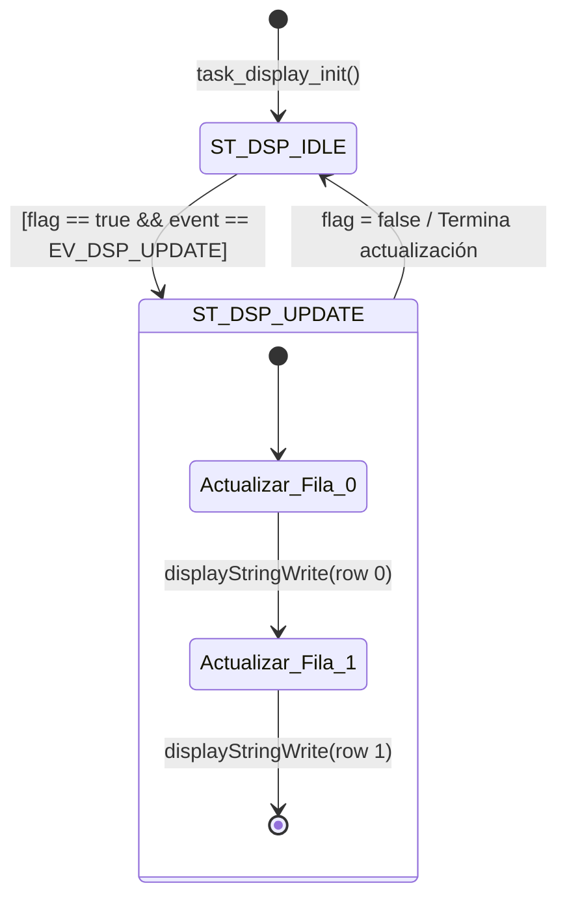
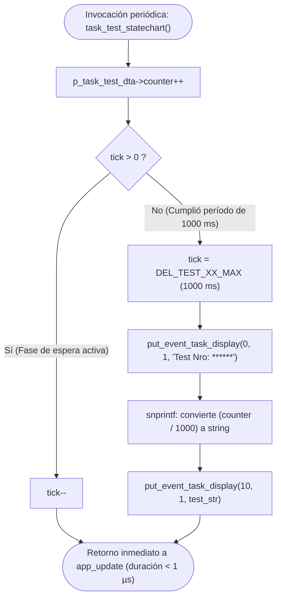
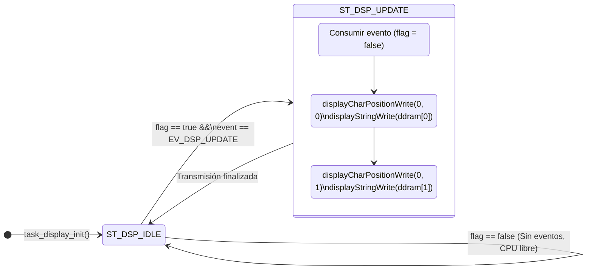

# Trabajo Práctico: LCD Display (Porting C Code) - System Setup (Statechart - Modeling - C Coding)

**Materia:** Técnicas Digitales / Sistemas Embebidos (TDSE)  
**Entorno:** STM32CubeIDE 1.19.0 & STM32Cube FW_F1 V1.8.6  
**Placa objetivo:** STM32 NUCLEO-F103RB (MCU: STM32F103RBT6, 64 MHz, SysTick = 1 ms)  

---

## 1. Respuesta a la Consulta

> **¿Puedes ayudarme a realizar un Trabajo Práctico sobre LCD Display (porting C code) - System Setup (statechart - modeling - c coding)?**

1. **Porting C Code:** Portar la librería del display LCD alfanumérico (controlador compatible con Hitachi HD44780) desde C++ (originalmente implementada para mbed / ARM Book usando clases como `DigitalOut` y funciones bloqueantes `delay`) hacia **ANSI C estándar** adaptado a la capa HAL de STM32 ([`main.h`](file:///home/joaquin/STM32CubeIDE/workspace_1.19.0/tdse-tp3_01-porting_c_code/Core/Inc/main.h) y `stm32f1xx_hal_gpio`).
2. **System Setup:** Configurar y validar la interfaz de hardware (modo 4 bits: líneas de datos `D4..D7`, control `RS` y `EN`), la base de tiempo de microsegundos mediante SysTick ([`systick.h`](file:///home/joaquin/STM32CubeIDE/workspace_1.19.0/tdse-tp3_01-porting_c_code/app/inc/systick.h) / [`systick.c`](file:///home/joaquin/STM32CubeIDE/workspace_1.19.0/tdse-tp3_01-porting_c_code/app/src/systick.c)) y el reloj del sistema a 64 MHz.
3. **Statechart & Modeling:** Modelar formalmente la tarea del display ([`task_display.c`](file:///home/joaquin/STM32CubeIDE/workspace_1.19.0/tdse-tp3_01-porting_c_code/app/src/task_display.c)) mediante una Máquina de Estados Finitos (FSM) cooperativa y no bloqueante, bajo el paradigma de Sistemas Disparados por Eventos (*Event-Triggered Systems - ETS*) y planificador *Cyclic Executive* (tick de 1 ms).
4. **C Coding:** Estructurar el código modularmente en capas desacopladas (Driver de Hardware $\rightarrow$ Interfaz de Tarea $\rightarrow$ Statechart de Tarea $\rightarrow$ Tarea de Test / Aplicación), respetando las pautas y convenciones de codificación de la cátedra TDSE.

---

## 2. Diagnóstico del Estado Actual del Proyecto

Al inspeccionar los archivos fuente en el espacio de trabajo ([`tdse-tp3_01-porting_c_code`](file:///home/joaquin/STM32CubeIDE/workspace_1.19.0/tdse-tp3_01-porting_c_code)), se identificó la situación inicial del código:

### 2.1. Problema en el Driver del Display ([`display.c`](file:///home/joaquin/STM32CubeIDE/workspace_1.19.0/tdse-tp3_01-porting_c_code/app/src/display.c))
El archivo [`app/src/display.c`](file:///home/joaquin/STM32CubeIDE/workspace_1.19.0/tdse-tp3_01-porting_c_code/app/src/display.c) aún conserva dependencias de C++ / mbed:
- Definición de objetos `DigitalOut displayD4( D4 );`, `DigitalOut displayRs( D8 );`, etc., que provocan errores de compilación (`error: unknown type name 'DigitalOut'`).
- Asignaciones directas del tipo `displayD4 = value;` no válidas en C.
- Invocaciones a funciones `delay()` que no se encuentran declaradas para C ni vinculadas a retardos en microsegundos requeridos por el bus del HD44780.

### 2.2. Mapeo de Hardware Disponible ([`Core/Inc/main.h`](file:///home/joaquin/STM32CubeIDE/workspace_1.19.0/tdse-tp3_01-porting_c_code/Core/Inc/main.h))
El generador STM32CubeMX ya tiene configurados los pines GPIO para la placa NUCLEO-F103RB:
- `D4_Pin` $\rightarrow$ `GPIOB, GPIO_PIN_5`
- `D5_Pin` $\rightarrow$ `GPIOB, GPIO_PIN_4`
- `D6_Pin` $\rightarrow$ `GPIOB, GPIO_PIN_10`
- `D7_Pin` $\rightarrow$ `GPIOA, GPIO_PIN_8`
- `D8_Pin` (RS) $\rightarrow$ `GPIOA, GPIO_PIN_9`
- `D9_Pin` (EN) $\rightarrow$ `GPIOC, GPIO_PIN_7`
- Línea `RW` del LCD conectada físicamente a masa (modo solo escritura).

### 2.3. Soporte para Retardos de Precisión ([`app/src/systick.c`](file:///home/joaquin/STM32CubeIDE/workspace_1.19.0/tdse-tp3_01-porting_c_code/app/src/systick.c))
Se cuenta con la función [`systick_delay_us(uint32_t delay_us)`](file:///home/joaquin/STM32CubeIDE/workspace_1.19.0/tdse-tp3_01-porting_c_code/app/src/systick.c#L51) que calcula ciclos de conteo del SysTick a 64 MHz, permitiendo generar los retardos de 1 µs y 37 µs necesarios para las señales `EN` y el tiempo de ejecución de comandos del LCD sin alterar la base de tiempo del sistema operativo bare-metal.

---

## 3. Arquitectura del Sistema y Statechart (Modeling)

### 3.1. Arquitectura en Capas
El sistema sigue un diseño estrictamente desacoplado:

```
+-------------------------------------------------------------+
|                      app.c (Cyclic Executive)               |
|      - Ejecución periódica cada 1 ms (SysTick Interrupt)     |
+------------------------------+------------------------------+
                               |
            +------------------+------------------+
            |                                     |
            v                                     v
+-----------------------+             +-----------------------+
|      task_test.c      |             |     task_display.c    |
| (Generación de datos) |             | (FSM / Statechart)    |
+-----------+-----------+             +-----------+-----------+
            |                                     ^
            | put_event_task_display(...)         | Lee DDRAM local y
            v                                     | banderas de eventos
+-------------------------------------------------+-----------+
|          task_display_interface.c / attribute.h             |
|   - Buffer intermedio: ddram[ROWS][COLUMNS+1]               |
|   - Eventos: EV_DSP_UPDATE, flags                           |
+-------------------------------------------------------------+
                               |
                               v
+-------------------------------------------------------------+
|                  display.c (Ported C Driver)                |
|   - Inicialización 4 bits (displayInit)                     |
|   - Control de pines (displayPinWrite, displayCodeWrite)    |
|   - Retardos HD44780 (systick_delay_us)                     |
+-------------------------------------------------------------+
                               |
                               v
+-------------------------------------------------------------+
|               STM32 HAL / Hardware GPIO Registers           |
|   - HAL_GPIO_WritePin (D4_GPIO_Port, D4_Pin, ...)           |
+-------------------------------------------------------------+
```

### 3.2. Modelado de la Máquina de Estados (Statechart de `task_display`)

La máquina de estados de [`task_display`](file:///home/joaquin/STM32CubeIDE/workspace_1.19.0/tdse-tp3_01-porting_c_code/app/src/task_display.c) procesa las solicitudes de actualización del display de forma cooperativa:



> [!NOTE]
> En implementaciones avanzadas de TDSE, si la actualización completa bloquea por más de 1 ms la CPU, el statechart de `task_display` puede descomponerse en una FSM que envíe **un carácter por cada tick de 1 ms**, garantizando un tiempo de ejecución determinístico $\ll 1\text{ ms}$ por ciclo.

---

## 4. Plan de Trabajo Propuesto para el TP

### Fase 1: Porting C Code de `display.c`
1. **Eliminación de C++ / mbed:** Reemplazar las instancias de `DigitalOut` por funciones C que utilicen `HAL_GPIO_WritePin(...)`.
2. **Abstracción de Pines:** Implementar una tabla de pines o un `switch(pinName)` en [`displayPinWrite`](file:///home/joaquin/STM32CubeIDE/workspace_1.19.0/tdse-tp3_01-porting_c_code/app/src/display.c#L243) asociando `DISPLAY_PIN_D4..D7`, `DISPLAY_PIN_RS` y `DISPLAY_PIN_EN` a los puertos y pines de STM32 (`D4_GPIO_Port`, `D4_Pin`, etc.).
3. **Manejo de Retardos:** Sustituir llamadas a `delay()`:
   - Para retardos largos en inicialización: `HAL_Delay(...)`.
   - Para retardos de bus y pulsos `EN` (~1 µs a ~37 µs): `systick_delay_us(...)`.
4. **Verificación de Compilación:** Compilar con `arm-none-eabi-gcc` asegurando 0 errores y 0 advertencias.

### Fase 2: Configuración del Sistema (System Setup)
1. **Validación de Relojes y SysTick:** Constatar que el microcontrolador opere a 64 MHz con actualización de ticks a 1 ms.
2. **Revisión de GPIOs en `main.c`:** Asegurar que los pines D4, D5, D6, D7, D8 (RS) y D9 (EN) se inicialicen como salidas push-pull sin resistencias pull-up/pull-down y velocidad adecuada.
3. **Integración de Logger:** Habilitar salida de texto por consola UART ([`logger.h`](file:///home/joaquin/STM32CubeIDE/workspace_1.19.0/tdse-tp3_01-porting_c_code/app/inc/logger.h)) para trazabilidad y depuración de estados.

### Fase 3: Statechart & Modeling
1. **Estructura de Datos:** Confirmar la definición de `task_display_dta_t` en [`task_display_attribute.h`](file:///home/joaquin/STM32CubeIDE/workspace_1.19.0/tdse-tp3_01-porting_c_code/app/inc/task_display_attribute.h) (estados, eventos, buffers de filas/columnas).
2. **Interfaz de Eventos:** Verificar `put_event_task_display()` en [`task_display_interface.c`](file:///home/joaquin/STM32CubeIDE/workspace_1.19.0/tdse-tp3_01-porting_c_code/app/src/task_display_interface.c).
3. **Comportamiento No Bloqueante:** Evaluar el impacto en el tiempo de CPU usando el ciclo de medición [`dwt.h`](file:///home/joaquin/STM32CubeIDE/workspace_1.19.0/tdse-tp3_01-porting_c_code/app/inc/dwt.h) para validar la cota temporal de cada tarea en el *Cyclic Executive*.

### Fase 4: Integración, Pruebas y Validación
1. **Tarea de Test ([`task_test.c`](file:///home/joaquin/STM32CubeIDE/workspace_1.19.0/tdse-tp3_01-porting_c_code/app/src/task_test.c)):** Ejecutar la rutina que muestra:
   - Fila 0: `"LCD Display Test"`
   - Fila 1: Contador dinámico incremental `"Test Nro: XXXXX"` cada 1000 ms.
2. **Verificación en Placa NUCLEO:** Probar sobre hardware físico o entorno de depuración.

---

## 5. Próximo Paso Inmediato

¿Deseas que comencemos ahora mismo con la **Fase 1 (Porting C Code de `display.c`)** adaptando las funciones de bajo nivel y eliminando los errores de `DigitalOut` para dejar el proyecto compilando de forma limpia?

---

## 6. Análisis Detallado del Código Fuente del Sistema

En esta sección se detalla el funcionamiento de cada uno de los archivos fuente que componen la arquitectura del proyecto, organizados según su rol en el sistema:

### 6.1. Capa de Gestión del Tiempo y Despacho de Tareas

#### 1. [`app_it.c`](file:///home/joaquin/STM32CubeIDE/workspace_1.19.0/tdse-tp3_01-porting_c_code/app/src/app_it.c) (Gestión de Interrupciones del Sistema)
- **Variable Global de Ticks:** Declara `volatile uint32_t g_app_tick_cnt;`, variable global volátil que actúa como contador de eventos de tiempo generados por el temporizador del núcleo (SysTick).
- **`app_it_init()`:** Inicializa `g_app_tick_cnt = 0` dentro de una sección crítica protegida con instrucciones en ensamblador inline (`__asm("CPSID i")` para deshabilitar interrupciones y `__asm("CPSIE i")` para habilitarlas), garantizando una inicialización atómica.
- **`HAL_SYSTICK_Callback()`:** Callback del temporizador SysTick que el framework HAL invoca cada **1 milisegundo** (frecuencia de 1000 Hz). En cada interrupción incrementa `g_app_tick_cnt++`.
- **`HAL_GPIO_EXTI_Callback(uint16_t GPIO_Pin)`:** Rutina de servicio para interrupciones externas generadas por pulsadores (como `BTN_A_PIN`). Deja listo el gancho para eventos externos.

#### 2. [`app.c`](file:///home/joaquin/STM32CubeIDE/workspace_1.19.0/tdse-tp3_01-porting_c_code/app/src/app.c) (Despachador Cyclic Executive / ETS)
- **Paradigma:** Implementa un planificador cooperativo por tiempo (*Cyclic Executive*) para sistemas disparados por eventos (*Bare Metal - Event-Triggered Systems - ETS*).
- **Estructuras de Configuración y Métricas:**
  - `task_cfg_t`: Tabla `task_cfg_list[]` que almacena los punteros a función de inicialización (`task_init`) y actualización periódica (`task_update`), junto con punteros a parámetros, para cada tarea registrada (`task_test` y `task_display`).
  - `task_dta_t`: Estructura que registra métricas de rendimiento en tiempo real para cada tarea:
    - `NOE` (*Number of Execution*): Contador de veces que se ejecutó la tarea.
    - `LET` (*Last Execution Time*): Duración en microsegundos de la última ejecución.
    - `BCET` (*Best-Case Execution Time*): Mejor tiempo de ejecución registrado (mínimo).
    - `WCET` (*Worst-Case Execution Time*): Peor tiempo de ejecución registrado (máximo).
- **`app_init()`:**
  - Inicializa el contador de ciclos del módulo DWT (`cycle_counter_init()`).
  - Itera sobre el arreglo de tareas ejecutando sus funciones de inicialización (`task_test_init` y `task_display_init`).
  - Inicializa los valores base de las métricas (`NOE=0`, `LET=0`, `BCET=1000`, `WCET=0`).
  - Llama a `app_it_init()` para habilitar la contabilización de interrupciones de tiempo.
- **`app_update()`:**
  - Bucle de despacho cooperativo invocado de forma infinita desde el `main()`.
  - Verifica si `g_app_tick_cnt > 0` en sección crítica (`CPSID i` / `CPSIE i`). Si hay ticks acumulados, los decrementa y activa la bandera `b_time_update_required = true`.
  - Mientras `b_time_update_required` sea verdadero:
    - Incrementa el contador global de ejecuciones `g_app_cnt++`.
    - Itera secuencialmente sobre todas las tareas:
      1. Resetea el contador de ciclos DWT con `cycle_counter_reset()`.
      2. Invoca el método `task_update` de la tarea correspondiente.
      3. Mide los microsegundos transcurridos con `cycle_counter_get_time_us()` y actualiza `LET`, `BCET`, `WCET` y el tiempo total del ciclo `g_app_runtime_us`.
    - Vuelve a verificar de forma atómica si quedaron ticks pendientes (mecanismo de recuperación si alguna tarea consumió más de un tick).

#### 3. [`systick.c`](file:///home/joaquin/STM32CubeIDE/workspace_1.19.0/tdse-tp3_01-porting_c_code/app/src/systick.c) (Temporización Precisa en Microsegundos)
- **Función:** [`systick_delay_us(uint32_t delay_us)`](file:///home/joaquin/STM32CubeIDE/workspace_1.19.0/tdse-tp3_01-porting_c_code/app/src/systick.c#L51).
- **Funcionamiento Interno:**
  - Accede directamente a los registros del temporizador ARM Cortex-M: `SysTick->VAL` (valor actual descendente del contador) y `SysTick->LOAD` (valor de recarga).
  - Multiplica el retardo pedido en microsegundos por la frecuencia del sistema: $\text{target} = \text{delay\_us} \times (\text{SystemCoreClock} / 1\,000\,000\text{ Hz})$, es decir, 64 ciclos por microsegundo a 64 MHz.
  - Ejecuta una espera activa calculando el tiempo transcurrido `elapsed = start - current`. Si el contador desborda (wrap-around a recarga), ajusta la cuenta sumando `SysTick->LOAD`.
  - **Importancia:** Permite generar retardos precisos de 1 µs y 37 µs exigidos por el bus del controlador LCD HD44780 sin interferir con la cuenta periódica de interrupciones de 1 ms generadas por el SysTick.

---

### 6.2. Capa de la Tarea de Prueba (Task Test)

#### 4. [`task_test_attribute.h`](file:///home/joaquin/STM32CubeIDE/workspace_1.19.0/tdse-tp3_01-porting_c_code/app/inc/task_test_attribute.h) (Estructuras de la Tarea de Test)
- Declara la estructura [`task_test_dta_t`](file:///home/joaquin/STM32CubeIDE/workspace_1.19.0/tdse-tp3_01-porting_c_code/app/inc/task_test_attribute.h#L51) que encapsula:
  - `uint32_t tick`: Temporizador por software decrementado en cada tick de 1 ms.
  - `uint32_t counter`: Contador acumulativo de ticks (milisegundos) para generar eventos y cómputo de tiempo.
- Expone la variable global `extern task_test_dta_t task_test_dta;`.

#### 5. [`task_test.c`](file:///home/joaquin/STM32CubeIDE/workspace_1.19.0/tdse-tp3_01-porting_c_code/app/src/task_test.c) (Generación y Publicación de Datos de Prueba)
- **`task_test_init()`:**
  - Registra información de diagnóstico por consola UART vía `LOGGER_INFO`.
  - Fija `tick = DEL_TEST_XX_MAX` (1000 ms = 1 segundo) y `counter = 0`.
  - Envía la pantalla de bienvenida inicial mediante la API del display:
    - Fila 0, Columna 0: `"LCD Display Test"`
    - Fila 1, Columna 0: `" Porting C code "`
- **`task_test_update()`:**
  - Invocado cada 1 ms por el despachador.
  - Ejecuta directamente [`task_test_statechart()`](file:///home/joaquin/STM32CubeIDE/workspace_1.19.0/tdse-tp3_01-porting_c_code/app/src/task_test.c#L101).

---

### 6.3. Capa de la Tarea del Display (Task Display & Interface)

#### 6. [`task_display_attribute.h`](file:///home/joaquin/STM32CubeIDE/workspace_1.19.0/tdse-tp3_01-porting_c_code/app/inc/task_display_attribute.h) (Atributos, Eventos y Estados del Display)
- **Dimensiones:** `ROWS = 2`, `COLUMNS = 16`.
- **Eventos (`task_display_ev_t`):**
  - `EV_DSP_IDLE`: Tarea en reposo, sin solicitudes de actualización.
  - `EV_DSP_UPDATE`: Solicitud activa de refresco de pantalla.
- **Estados (`task_display_st_t`):**
  - `ST_DSP_IDLE`: Estado de espera de eventos.
  - `ST_DSP_UPDATE`: Estado de procesamiento y actualización física del display.
- **Estructura de Datos [`task_display_dta_t`](file:///home/joaquin/STM32CubeIDE/workspace_1.19.0/tdse-tp3_01-porting_c_code/app/inc/task_display_attribute.h#L60):**
  - `tick`: Temporizador para operaciones de retardo.
  - `state`: Estado actual de la máquina de estados.
  - `event`: Evento pendiente a procesar.
  - `flag`: Bandera booleana de presencia de nuevo evento (`true`/`false`).
  - `ddram[ROWS][COLUMNS+1]`: Matriz bidimensional que almacena la memoria sombra local (DDRAM virtual) del display (2 líneas de 16 caracteres + fin de cadena `\0`).
  - `row`, `column`, `character`: Variables de control para indexación de escritura.

#### 7. [`task_display_interface.c`](file:///home/joaquin/STM32CubeIDE/workspace_1.19.0/tdse-tp3_01-porting_c_code/app/src/task_display_interface.c) (API de Desacoplamiento entre Tareas)
- **Función:** [`put_event_task_display(uint32_t char_column, uint32_t char_row, const char *message)`](file:///home/joaquin/STM32CubeIDE/workspace_1.19.0/tdse-tp3_01-porting_c_code/app/src/task_display_interface.c#L59).
- **Comportamiento:**
  - Activa la bandera de notificación: `p_task_display_dta->flag = true`.
  - Configura el evento: `p_task_display_dta->event = EV_DSP_UPDATE`.
  - Copia los caracteres de `message` en el buffer local `ddram[char_row][char_column++]` verificando que no se superen los límites físicos de filas ni columnas del display.
  - **Ventaja de Diseño:** Desacopla por completo la tarea consumidora (display) de las tareas productoras (`task_test` u otras). Las tareas productoras escriben en memoria RAM sin bloquearse por los lentos tiempos de respuesta del bus físico del LCD.

#### 8. [`task_display.c`](file:///home/joaquin/STM32CubeIDE/workspace_1.19.0/tdse-tp3_01-porting_c_code/app/src/task_display.c) (Lógica de la Tarea del Display)
- **`task_display_init()`:**
  - Inicializa las variables de estado: `state = ST_DSP_IDLE`, `event = EV_DSP_IDLE`, `flag = false`.
  - Inicializa el hardware físico del LCD en modo de 4 bits llamando a `displayInit(DISPLAY_CONNECTION_GPIO_4BITS)`.
  - Transmite el contenido inicial cargado en la DDRAM hacia las dos filas del LCD físico usando `displayCharPositionWrite` y `displayStringWrite`.
- **`task_display_update()`:**
  - Invocado cada 1 ms por el *Cyclic Executive*.
  - Despacha la máquina de estados llamando a [`task_display_statechart()`](file:///home/joaquin/STM32CubeIDE/workspace_1.19.0/tdse-tp3_01-porting_c_code/app/src/task_display.c#L120).

---

### 6.4. Capa del Driver de Hardware del Display (Display Driver)

#### 9. [`display.h`](file:///home/joaquin/STM32CubeIDE/workspace_1.19.0/tdse-tp3_01-porting_c_code/app/inc/display.h) (Interfaz Pública del Driver HD44780)
- Define el modo de conexión `displayConnection_t`:
  - `DISPLAY_CONNECTION_GPIO_4BITS`: Conexión de 4 bits de datos (`D4..D7`), la estándar utilizada en este proyecto.
  - `DISPLAY_CONNECTION_GPIO_8BITS`: Conexión de 8 bits de datos (`D0..D7`).
- Declara las funciones públicas de control:
  - `displayInit`: Secuencia de inicialización del controlador.
  - `displayCharPositionWrite`: Selección de fila y columna en memoria DDRAM.
  - `displayStringWrite`: Impresión de secuencias de caracteres terminadas en `\0`.

#### 10. [`display.c`](file:///home/joaquin/STM32CubeIDE/workspace_1.19.0/tdse-tp3_01-porting_c_code/app/src/display.c) (Implementación del Protocolo HD44780)
- **Conjunto de Instrucciones HD44780 (Constantes Binarias):**
  - `DISPLAY_IR_CLEAR_DISPLAY` (`0b00000001`): Limpia pantalla y retorna cursor a origen.
  - `DISPLAY_IR_ENTRY_MODE_SET` (`0b00000100`): Dirección de desplazamiento de cursor tras cada carácter (incremento automático sin desplazamiento de display).
  - `DISPLAY_IR_DISPLAY_CONTROL` (`0b00001000`): Control de encendido de pantalla, visualización de cursor y parpadeo (blink).
  - `DISPLAY_IR_FUNCTION_SET` (`0b00100000`): Modo de bus (4 u 8 bits), número de líneas (1 o 2 líneas) y matriz tipográfica (5x8 puntos).
  - `DISPLAY_IR_SET_DDRAM_ADDR` (`0b10000000`): Modificación de la dirección del puntero DDRAM. Las direcciones base de cada fila son:
    - Fila 0: Dirección 0 (`0x00`)
    - Fila 1: Dirección 64 (`0x40`)
- **Funciones Internas de Bajo Nivel:**
  - `displayPinWrite`: Conmuta los pines físicos (`D4..D7`, `RS`, `EN`). *(Archivo que actualmente contiene la sintaxis de C++ `DigitalOut` a ser portada a `HAL_GPIO_WritePin`)*.
  - `displayDataBusWrite`: Gestiona la multiplexación temporal del bus de 4 bits. Escribe primero el nibble alto (`D7..D4`), genera un pulso en alto de `EN` para que el LCD lo lea, y a continuación desplaza el nibble bajo (`D3..D0`) hacia los mismos pines `D7..D4` y genera el segundo pulso de validación en `EN`.
  - `displayCodeWrite`: Configura el pin `RS` (0 para instrucciones/comandos, 1 para caracteres de datos), el pin `RW` en 0 (modo escritura) y envía el byte a través de `displayDataBusWrite`.
  - `displayInit`: Implementa el algoritmo de inicialización por software especificado en la hoja de datos del Hitachi HD44780:
    1. Espera de arranque superior a 40 ms tras encendido.
    2. Envío de tres comandos Function Set sucesivos forzando modo de 8 bits con esperas intermedias para garantizar la sincronización del controlador independientemente del estado previo.
    3. Envío del comando de selección de modo de 4 bits.
    4. Configuración definitiva de 2 líneas y fuente 5x8.
    5. Apagado de display, borrado de pantalla, configuración de modo de entrada (incremento a la derecha) y encendido final del display.

---

## 7. Comportamiento Específico de las Funciones Statechart

### 7.1. Comportamiento de `void task_test_statechart(void)`

La función [`task_test_statechart(void)`](file:///home/joaquin/STM32CubeIDE/workspace_1.19.0/tdse-tp3_01-porting_c_code/app/src/task_test.c#L101) es el núcleo algorítmico de la tarea de prueba. Se invoca cada **1 milisegundo** de forma ininterrumpida por el planificador cooperativo:

```c
void task_test_statechart(void)
{
    task_test_dta_t *p_task_test_dta;
    char test_str[8];

    p_task_test_dta = &task_test_dta;

    p_task_test_dta->counter++;

    if (DEL_TEST_XX_MIN < p_task_test_dta->tick)
    {
        p_task_test_dta->tick--;
    }
    else
    {
        p_task_test_dta->tick = DEL_TEST_XX_MAX;

        put_event_task_display(0, 1, "Test Nro: ******");

        snprintf(test_str, sizeof(test_str), "%lu", (p_task_test_dta->counter/DEL_TEST_XX_MAX));
        put_event_task_display(10, 1, test_str);
    }
}
```

#### Análisis Paso a Paso del Comportamiento:
1. **Contador Global de Ticks (`counter++`):**
   - En cada invocación (1 ms), incrementa la variable `counter`. Esto permite contabilizar el tiempo absoluto transcurrido desde el inicio de la tarea.
2. **Temporización No Bloqueante por Software (`tick`):**
   - Comprueba si `tick > DEL_TEST_XX_MIN` (donde `DEL_TEST_XX_MIN = 0`):
     - **Durante 999 ms de cada segundo:** `tick` es mayor que 0. La función simplemente lo decrementa (`tick--`) y concluye inmediatamente su ejecución. **No bloquea el sistema ni detiene la CPU**.
     - **Al cumplirse el milisegundo 1000 (1 segundo exacto):** `tick` llega a 0 y se entra a la rama `else`.
3. **Disparo Periódico de Eventos (Cada 1 segundo):**
   - **Recarga del temporizador:** `p_task_test_dta->tick = DEL_TEST_XX_MAX` (se recarga en 1000 ms para iniciar el siguiente ciclo).
   - **Publicación de la Plantilla Base:** Ejecuta `put_event_task_display(0, 1, "Test Nro: ******")`, lo que escribe la cadena en la fila 1 (segunda línea del display) a partir de la columna 0, fija el evento `EV_DSP_UPDATE` y levanta la bandera `flag = true`.
   - **Formateo y Publicación del Contador:**
     - Calcula el número de segundos transcurridos mediante la división entera `counter / DEL_TEST_XX_MAX`.
     - Convierte ese valor entero en una cadena de caracteres formateada con `snprintf(test_str, sizeof(test_str), "%lu", ...)`.
     - Invoca `put_event_task_display(10, 1, test_str)`, sobreescribiendo los asteriscos de la posición 10 con el valor numérico en segundos (ej. `"0"`, `"1"`, `"2"`, etc.).



---

### 7.2. Comportamiento de `void task_display_statechart(void)`

La función [`task_display_statechart(void)`](file:///home/joaquin/STM32CubeIDE/workspace_1.19.0/tdse-tp3_01-porting_c_code/app/src/task_display.c#L120) es la máquina de estados finitos (FSM) que controla la transferencia de datos hacia el LCD. Se ejecuta cada **1 milisegundo**:

```c
void task_display_statechart(void)
{
    task_display_dta_t *p_task_display_dta;

    p_task_display_dta = &task_display_dta;

    switch (p_task_display_dta->state)
    {
        case ST_DSP_IDLE:

            if ((true == p_task_display_dta->flag) && (EV_DSP_UPDATE == p_task_display_dta->event))
            {
                p_task_display_dta->state = ST_DSP_UPDATE;
            }

            break;

        case ST_DSP_UPDATE:

            if ((true == p_task_display_dta->flag) && (EV_DSP_UPDATE == p_task_display_dta->event))
            {
                p_task_display_dta->flag = false;
                p_task_display_dta->state = ST_DSP_UPDATE;
                p_task_display_dta->row = 0;
                p_task_display_dta->column = 0;

                displayCharPositionWrite(0, 0);
                p_task_display_dta->row = 0;
                displayStringWrite(p_task_display_dta->ddram[p_task_display_dta->row]);

                displayCharPositionWrite(0, 1);
                p_task_display_dta->row = 1;
                displayStringWrite(p_task_display_dta->ddram[p_task_display_dta->row]);

                p_task_display_dta->state = ST_DSP_IDLE;
            }

            break;

        default:

            p_task_display_dta->tick  = DEL_DSP_MIN;
            p_task_display_dta->state = ST_DSP_IDLE;
            p_task_display_dta->event = EV_DSP_IDLE;
            p_task_display_dta->flag = false;

            break;
    }
}
```

#### Análisis Paso a Paso del Comportamiento:

1. **Estado `ST_DSP_IDLE` (Espera de Petición):**
   - Evalúa la guarda: `flag == true` y `event == EV_DSP_UPDATE`.
   - **Si no hay eventos pendientes (`flag == false`):** No realiza ninguna operación. La función sale de inmediato sin tocar el hardware, asegurando que la CPU se libere en un tiempo insignificante ($\approx 1\text{ µs}$).
   - **Si se detecta un evento pendiente:** Conmuta el estado a `ST_DSP_UPDATE`.
2. **Estado `ST_DSP_UPDATE` (Escritura Física de Datos):**
   - Valida nuevamente la presencia del evento y la bandera.
   - **Baja de bandera:** Asigna `p_task_display_dta->flag = false` para acusar recibo y consumir el evento.
   - **Actualización de la Fila 0:**
     - Llama a `displayCharPositionWrite(0, 0)` para ubicar el cursor del controlador HD44780 en la primera posición de la primera línea (dirección DDRAM `0x00`).
     - Llama a `displayStringWrite(p_task_display_dta->ddram[0])`, enviando de manera consecutiva los 16 caracteres de la memoria sombra correspondiente a la fila superior.
   - **Actualización de la Fila 1:**
     - Llama a `displayCharPositionWrite(0, 1)` para mover el cursor a la primera posición de la segunda línea (dirección DDRAM `0x40`).
     - Llama a `displayStringWrite(p_task_display_dta->ddram[1])`, enviando los 16 caracteres de la fila inferior.
   - **Transición de Retorno:** Una vez finalizada la transmisión de ambas líneas, retorna automáticamente al estado de reposo: `state = ST_DSP_IDLE`.
3. **Rama `default` (Mecanismo a Prueba de Fallos / Fail-Safe):**
   - Si la variable `state` sufriera corrupción de memoria o adquiriera un valor inválido fuera de la enumeración, el bloque `default` fuerza un reinicio controlado de la FSM: limpia la bandera `flag = false`, restablece `event = EV_DSP_IDLE` y coloca el estado nuevamente en `ST_DSP_IDLE`.



---
